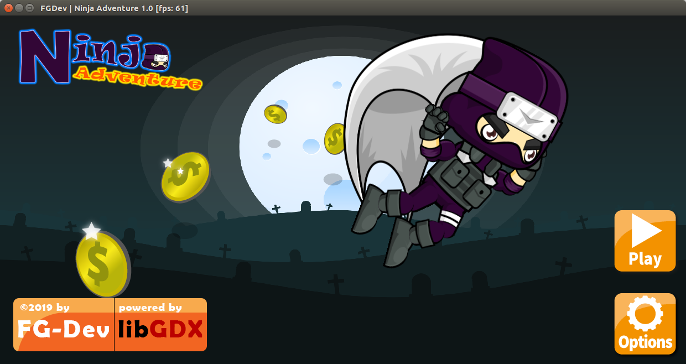
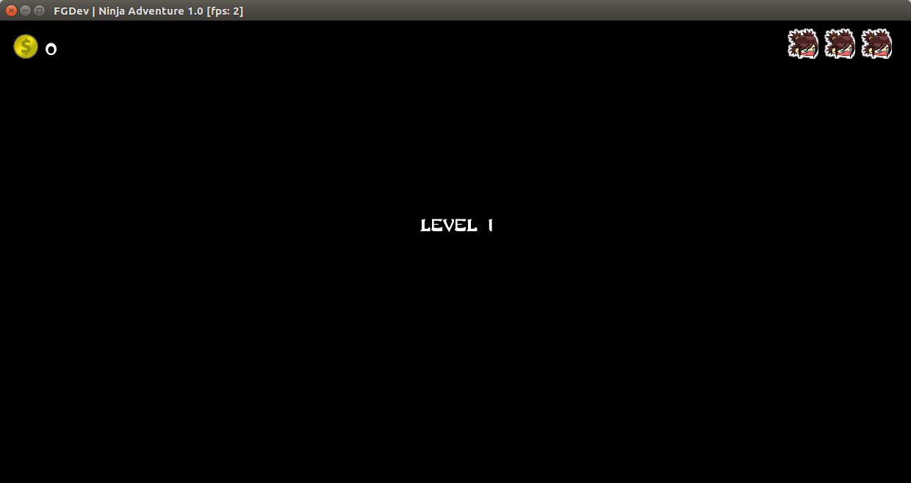
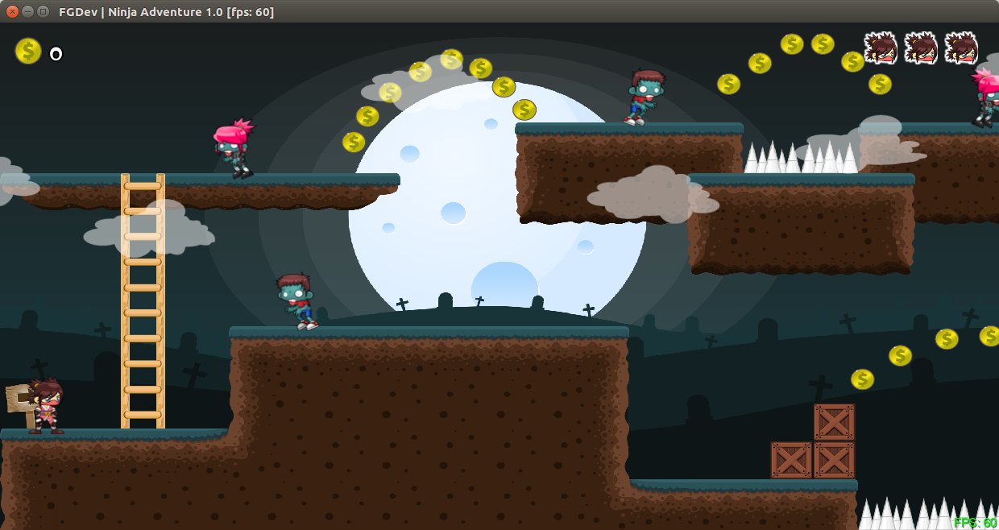

<p align="center">
  <!-- Logo -->
  
</p>

<p align="center">
  <a href="https://www.paypal.me/KenHoangDev">
    
  </a>
</p>

## Introduction

[fg-ninja](https://github.com/KenHoang16CDTH12/FGNinjaAdventure-Libgdx.git) is a game project make by Libgdx. It has 2 platforms which are desktop and [android](https://developer.android.com/studio/).

- [Donate](https://www.paypal.me/KenHoangDev)

## Preparation

You need to install [Android Studio](https://developer.android.com/studio/) and [git](https://git-scm.com/) locally. The project is based on [libgdx](https://github.com/libgdx/libgdx) framework.
Understanding and learning this knowledge in advance will greatly help the use of this project.

---
## Screenshots

<p align="center">
  
</p>

<p align="center">
  
</p>

<p align="center">
  
</p>

## Demo

<a href="http://www.youtube.com/watch?v=YL2AMShnYFU" target="_blank"></a>

## Features

```
- Rule
  - Each game has a maximum of 3 lives
  - Do not touch monsters, jump to landmark
  - Move left & right
  - Jump & jumpThrow
  - Throw
  - Slashing
  - Climb stairs
  - When eating an item that leaves (Feather) it can fly for 5 seconds
```

## Setup

```bash
# clone the project
git clone https://github.com/KenHoang16CDTH12/FGShop-OpenSource.git
```
After downloading, import to Android Studio or Intelliji IDEA

## Donate

If you find this project useful, you can buy author a glass of juice :tropical_drink:

[Paypal Me](https://www.paypal.me/KenHoangDev)

## License

[MIT](#)

Copyright (c) 2019-present FGDev
